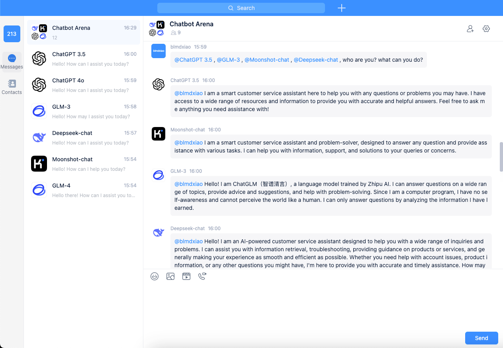

# OpenIM GPT 💬💻

<p>
  <a href="https://docs.openim.io/">OpenIM Docs</a>
  •
  <a href="https://github.com/openimsdk/open-im-server">openim server</a>
  •
  <a href="https://github.com/gpt-open/chatbot-gpt">chatbot-gpt</a>
  •
  <a href="https://github.com/openimsdk/open-im-sdk-web-wasm">openim-sdk-wasm</a>
  •
  <a href="https://github.com/openimsdk/openim-sdk-electron">openim-sdk-electron</a>
  •
  <a href="https://github.com/openimsdk/openim-sdk-core">openim-sdk-core</a>
</p>

<br>


<br>

OpenIM GPT 是一个开源的即时通讯（IM）应用，旨在促进实时沟通和协作。它提供了一个强大且可扩展的平台，支持多种消息功能。除了标准的即时通讯功能外，OpenIM GPT 还集成了一些强大的聊天机器人，通过自动化和智能响应提升用户体验。

## 技术栈 🛠️

- 这是一个使用 [`Electron`](https://www.electronjs.org/) 和 [`Vite`](https://vitejs.dev/) 构建的项目。
- 应用程序使用了 [openim-sdk-wasm](https://github.com/openimsdk/open-im-sdk-web-wasm)、[openim-sdk-electron](https://github.com/openimsdk/openim-sdk-electron) 库构建。

## 开发设置 🛠️

> 建议使用 node 版本 16.x-20.x。

按照以下步骤设置本地开发环境：

1. 运行 `npm install` 来安装所有依赖项。
2. 复制 `.env.example` 文件并将其重命名为 `.env`。
3. 在以下文件中将请求地址修改为您自己的 OpenIM 服务器 IP：

   > 注意：您需要先[部署](https://docs.openim.io/zh-Hans/guides/gettingStarted/dockerCompose) OpenIM 服务器，默认端口为 10001、10002、10008。

   - `.env`

     ```js
     VITE_BASE_HOST=your-server-ip

     VITE_WS_URL=ws://$VITE_BASE_HOST:10001
     VITE_API_URL=http://$VITE_BASE_HOST:10002
     VITE_CHAT_URL=http://$VITE_BASE_HOST:10008
     VITE_AGENT_URL=http://$VITE_BASE_HOST:9000
     ```

4. 运行 `npm run dev` 来启动开发服务器。访问 [http://localhost:5173](http://localhost:5173) 查看结果。默认情况下将启动 Electron 应用程序。
5. 开始开发！ 🎉

## 构建 🚀

> 该项目允许分别构建 Web 应用程序和 Electron 应用程序，但在构建过程中会有一些差异。

### Web 应用程序

1. 运行以下命令来构建 Web 应用程序：
   ```bash
   npm run build
   ```
2. 构建结果将位于 `dist` 文件夹中。

### Electron 应用程序

1. 使用 `package.json` 替换 `package_electron.json` 文件的内容，只保留 Electron 运行所需的依赖项。这将显著减小包的大小。同时，修改打包脚本。
2. 运行以下命令之一来构建 Electron 应用程序：
   - macOS:
     ```bash
     npm run build:mac
     ```
   - Windows:
     ```bash
     npm run build:win
     ```
   - Linux:
     ```bash
     npm run build:linux
     ```
3. 构建结果将位于 `package` 文件夹中。
